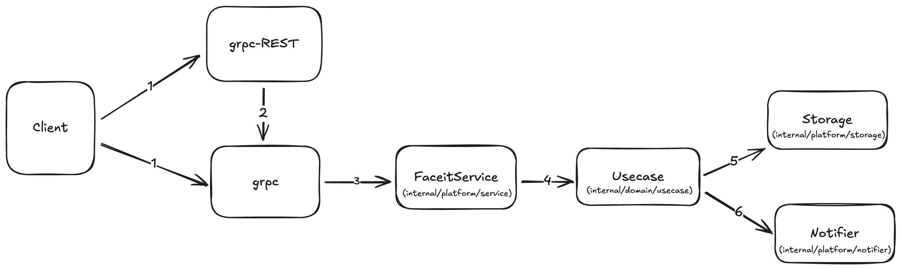

# Faceit Architecture

* Latest update: 2024-12-15

<!-- Short description of the service -->

## Overview



### Storage

The service makes use of its own private **PostgreSQL** database essentially to store the data necessary for the service to work, like user information.

### Notifier

The service uses **NoOp** notifier mock.

## Package Structure

```markdown
|
├── cmd # contains application executable.
├── internal # contains application specific non-reusable by any other projects code
│   ├── domain # contains domain layer definitions.
│   │   ├── [model](internal/domain/model) # contains application's models.
│   │   ├── [usecase](internal/domain/usecase) # contains application's use cases.
│   ├── platform
|   │   ├── [app](internal/platform/app) # initializes the application locator.
│   │   ├── [config](internal/platform/config) # contains application configuration.
│   │   ├── [notifier](internal/platform/notifier) # contains application configuration.
│   │   ├── [service](internal/platform/service) # contains grpc service implementations.
│   |   ├── [storage](internal/platform/storage) # contains usecase storage implementations.
├── resources # RECOMMENDED service resources. Shell helper scripts, additional files required for development, documentations.
|   |── [adr](resources/adr) # contains architecture decision records.
|   |── [architecture](resources/architecture) # contains architecture diagrams and any other design documents or images.
|	|── [migrations](resources/migrations) # contains sql migration files for the database.
|	|── [proto](resources/proto) # contains proto definition of the service.
|	|── [swagger](resources/swagger) # contains api documentation.
```

`cmd/`

    * Packages that provide support for a specific program that is being built.
    * Can only import package from `internal/platform` and `pgk`.
    * Can't import package from `internal/domain`.
    * Allowed to panic an application.
    * Wrap errors with context if not being handled.
    * Majority of handling errors happen here.
    * Can recover any panic.
    * Only if system can be returned to 100% integrity.

`internal\domain`

    * NOT allowed to panic an application.
    * Allowed to wrap errors when domain concern.
    * Wrap errors with context if not being handled.
    * Allowed to set policy about any application concerns.
    * Allowed to log and handle configuration natively.
    * Minority of handling errors happen here.
    * Stick to the testing package in go.
    * Test files belong inside the package.
    * Focus more on unit than integration testing.
    * Package at the same level are not allowed to import each other.
    * Package root can import subpackages.
    * Can't import `internal\platform` package

`internal\platform`

    * NOT allowed to panic an application.
    * NOT allowed to set policy about any application concerns.
    * NOT allowed to log, but access to trace information must be decoupled.
    * Configuration and runtime changes must be decoupled.
    * Retrieving metric and telemetry values must be decoupled.
    * Return only root cause error values.
    * Stick to the testing package in go.
    * Test files belong inside the package.
    * Focus more on unit than integration testing.
    * Packages can import each other.
    * Can import `internal\domain` package

This structure design is mostly inspired by [Package Oriented Design](https://www.ardanlabs.com/blog/2017/02/package-oriented-design.html) by William Kennedy.
